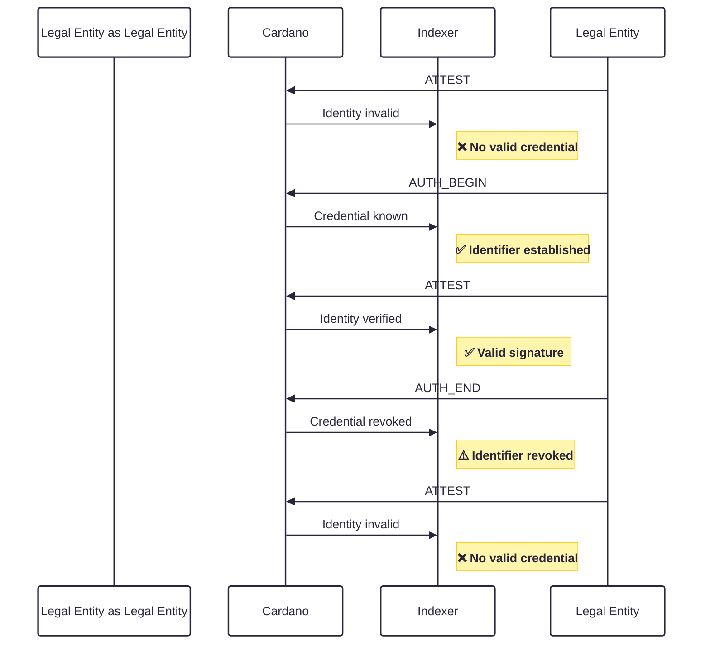
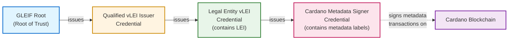

## Abstract

Accountability is essential for legal entities, organizations, and authorities operating in regulated environments. To establish accountability on the Cardano blockchain, it must be possible to prove the identity of entities responsible for on-chain actions in a verifiable and interoperable way.

This CIP defines a standardized mechanism to embed KERI ([Key Event Receipt Infrastructure](https://trustoverip.github.io/kswg-keri-specification/)) identifiers within Cardano transaction metadata. KERI provides self-certifying, portable, and decentralized identifiers known as Autonomic Identifiers (AIDs) that can be anchored to various roots of trust—such as verifiable Legal Entity Identifiers (vLEIs), organizational registries, or domain-specific trust frameworks. Identifiers can attest metadata as well as whole transactions, either within the attested transaction or by claiming a transaction that is already on chain.

By including KERI identifiers in transaction metadata, Cardano enables a flexible, trust-agnostic approach to identity binding. This approach supports accountability, legal and regulatory compliance, and interoperability with existing and emerging global identity ecosystems, while remaining compatible with self-sovereign identity principles.

## Motivation: Why is this CIP necessary?

The demand for auditable and verifiable identifiers is increasing as accountability, traceability, and transparency become fundamental requirements for entities operating within regulated environments. Without a standardized mechanism, it is difficult to reliably associate on-chain activity with persistent and legally recognized identities.

KERI (Key Event Receipt Infrastructure) addresses this challenge by introducing a decentralized, key-oriented identifier system that supports secure, portable, and self-certifying digital identities. Instead of relying on centralized registries, KERI establishes identifiers through cryptographically verifiable event logs, enabling secure key rotation, continuity of control, and tamper-evident auditability. This approach ensures that an identifier can consistently represent the same entity over time, while remaining interoperable with verifiable credentials and roots of trust such as verifiable Legal Entity Identifiers (vLEIs).

By embedding KERI identifiers into Cardano transaction metadata, this proposal enables a standardized and verifiable linkage between on-chain actions and off-chain accountability frameworks. This allows transactions to be cryptographically bound to a specific identifier and, through verifiable credential chains, to a legally recognized entity, thereby enhancing trust and compliance across decentralized and regulated ecosystems.


## Specification

Below a generic solution is defined to enable metadata signing where a particular ecosystem or use-case may leverage a root of trust of its choosing – each most likely with its own credential chain format.

The credentials used in the KERI ecosystem are known as ACDCs, or [Authentic Chained Data Containers](https://trustoverip.github.io/kswg-acdc-specification/). This CIP will not explain at depth how KERI and ACDCs work due to their technical complexity. The [Appendix](#appendix) will however include some expanded explanations to help provide clarity.

> [!NOTE]
> The key words "MUST", "MUST NOT", "REQUIRED", "SHALL", "SHALL NOT", "SHOULD", "SHOULD NOT", "RECOMMENDED", "NOT RECOMMENDED", "MAY", and "OPTIONAL" in this document are to be interpreted as described in BCP 14 [RFC2119](https://www.rfc-editor.org/rfc/rfc2119) [RFC8174](https://www.rfc-editor.org/rfc/rfc8174) when, and only when, they appear in all capitals, as shown here.

### Versioning

The specification is versioned as `major.minor`; the current version is `1.1`. Versions are compared numerically, part by part (`1.10` is later than `1.9`).

| Version | Adds |
|---|---|
| `1.0` | `AUTH_BEGIN`, `ATTEST` and `AUTH_END` records. |
| `1.1` | [`ATTEST_TX`](#attesting-a-transaction-attest_tx) records, including several signers of one transaction, [`CLAIM_TX`](#claiming-an-existing-transaction-claim_tx) records, and the [metadata seal](#metadata-seal) as an alternative KEL anchor for `ATTEST` records. |

A minor version only adds record types or optional forms. A record that is valid under an earlier minor version remains valid and keeps its meaning. A change that alters the meaning of existing records requires a new major version.

Every record carries the version it follows in `v.v`. Records of a type introduced in version `1.1` MUST carry `v`. A record of a version `1.0` type without `v` is interpreted as version `1.0`. `AUTH_BEGIN` and `AUTH_END` records additionally carry the minimum KERI version in `v.k` and the minimum ACDC version in `v.a`.

Indexers SHOULD ignore label `170` records with a value of `t` they do not support. Indexers implementing version `1.0` may not do so, and may reject records introduced in version `1.1`. Verifiers implementing version `1.0` report `ATTEST` records anchored with a metadata seal as unverified.

The CDDL ([`version_1.cddl`](version_1.cddl)) and JSON schema ([`version_1.json`](version_1.json)) define all records of major version 1. They constrain label `170` only; other labels in the same transaction may hold any metadata. Byte strings in the JSON schema use the 0x-prefixed hexadecimal form of the `cardano-cli` no-schema JSON mapping.

### Key Event Log Discovery
In order to verify the validity of credential chains and metadata transactions, Key Event Logs, or KELs, for all issuing and holding identifiers in the credential chain must be made available to a verifier. KELs may live off-chain for interoperability and scalability reasons, so this CIP does not make assumptions on which medium the KELs are published.

A KERI watcher network SHOULD be used to discover up-to-date KELs for a given identifier for certain security reasons. Discovery of the watcher network relevant to a given ecosystem depends on the ecosystem itself.

However, as KERI is a maturing technology, wide-spread deployment of watcher networks is not yet guaranteed. Until then, the interim solution is to publish an [Out-of-Band-Introduction](#discovery-via-out-of-band-introductions-oobis) via a known persistent channel for the specific project for discovery, and this may be used by a verifier to discover and query for KEL events and updates.

In one way or another, chain indexers must query for Key Event Log updates to validate credential chains and metadata transactions during the process of verification.

### Visualized Identity Lifecycle
The following diagram illustrates the lifecycle of signing authority for a KERI identifier on Cardano. It demonstrates how [attestations](#creation-of-verifiable-records) (`ATTEST`) are invalid before [authority is established](#establishment-of-signing-authority) (`AUTH_BEGIN`), become valid during the authenticated period, and become invalid again after [revocation](#revoking-of-signing-authority) (`AUTH_END`).


### Establishment of signing authority
Before attesting to any transactions, the relevant [credential chain](#credential-chains) for the controller must be published on-chain with the following attributes – most of which are used to help simplify indexing:
- **t** — A transaction type of `AUTH_BEGIN` is used to establish a signer’s authority using a credential chain.
- **i** — The identifier of the signer in the CESR qb64 variant. This MUST match the issuee of the leaf credential in the chain.
- **s** — The schema identifier of the leaf credential in the chain in the CESR qb64 variant. This MUST match the schema of the [leaf credential](#identifying-a-credential-chain-type) in the chain.
- **c** — The byte-stream of the credential chain in the CESR qb2 or qb64b variant, for brevity. A metadata byte string holds at most 64 bytes, so a longer stream is split into consecutive chunks of at most 64 bytes, stored in order as a list. Verifiers concatenate the chunks.
- **v** - Version of the CIP and minimum version of KERI and ACDC to ensure compatibility.
- **m** —  An optional metadata block used to simplify indexing for a particular use-case. For example, the LEI of a legal entity could be contained here.

The credential chain should contain all credentials, relevant registry events and attachments. There are various types of ACDC registries, so for simplicity: the credential chain MUST validate with an ACDC v1 or v2 verifier, assuming that KEL events are already available.

These attributes can be embedded in the metadata of a transaction using a fixed metadata label. Compact field labels are used for brevity.

The metadata is structured as follows:
```JSON
{
  "170":
  {
    "t": "AUTH_BEGIN",
    "s": "{{saidOfLeafCredentialSchema}}",
    "i": "{{aidOfSigner}}",
    "c": "{{byteStream}}",
    "v": {
      "v": "{{CIP Version String}}",
      "k": "{{KERI Version String}}",
      "a": "{{ACDC Version String}}"
    },
    "m": "{{optionalMetadataBlock}}"
  }
}
```
If valid for a given ecosystem, this transaction establishes the signing authority for `i` from this transaction onwards in the chain. The issuance date of the leaf credential SHOULD be ignored.

### Creation of verifiable records
To create a persistent signature over data with KERI, signers can anchor a digest of the data in their KEL, typically using an interaction event. Anchoring ensures that data remains verifiable even if the controller later rotates their keys.

 The relevant data recorded for each event includes:
- **t** — A transaction type of `ATTEST` is to create a verifiable record.
- **i** — The identifier of the signer in the CESR qb64 variant.
- **d** — The digest of the attested data in the CESR qb64 variant. If the transaction carries application metadata under another label, the digest MUST be computed over the CBOR encoding of the metadatum value at that label, byte-identical to the bytes in the transaction's auxiliary data — see [Digest computation](#digest-computation). The digest algorithm is identified by the CESR derivation code; implementations MUST support Blake3-256 (code `E`) and SHOULD use it when creating attestations. The KEL event at sequence number `s` MUST anchor either `d` itself or, from version `1.1`, the [metadata seal](#metadata-seal) computed from `d` and the attested label.
- **s** — The sequence number of the KERI event, encoded as a hex string.
- **v** - Version of the CIP. KERI and ACDC version isn't needed here.
If the KEL of identifier `i` contains an event at sequence number `s` which has a seal value of `{ d: "{{digest}}" }`, or of `{ d: "{{metadataSeal}}" }` for a record of version `1.1` or later whose `d` covers a metadatum in the same transaction, it serves as cryptographically verifiable proof that the data was effectively signed by the controller.

A reference to this event in a metadata transaction is structured as follows:
```JSON
{
    "170": {
    "t": "ATTEST",
    "i": "{{aidOfSigner}}", 
    "d": "{{digest}}",
    "s": "{{hexEncodedSequenceNumber}}",
    "v": {
      "v": "{{CIP Version String}}"
    },
    },
    "YYYY": "{{someApplicationMetadata}}"
}
```
Such transactions are only considered valid if the digest value is correct, and the digest, or for a record of version `1.1` or later the metadata seal computed from it and the attested label, can be found anchored in the KEL of the controller at the given sequence number.

#### Digest computation

What `d` refers to depends on whether the transaction carries application metadata:

- **If the transaction contains application metadata under another label** (the *attested label*, `YYYY` above), `d` MUST be the digest of the CBOR encoding of the metadatum **value** at that label, byte-identical to the bytes present in the transaction's auxiliary data. It is computed over the value only — not the label/value pair, not the whole metadata map, and not any JSON or other re-serialised representation. Implementations SHOULD digest the bytes that will be (or were) submitted rather than an independent re-serialisation: CBOR allows several encodings of the same structure (map key order, integer widths, indefinite-length items) and only the on-chain bytes are authoritative. If a use case places application metadata under more than one label, the use case MUST define which label is attested; a single application label per `ATTEST` transaction is RECOMMENDED.
- **If the transaction contains no application metadata**, the data referred to by `d` is defined by the use case (for example an off-chain document or a data set published elsewhere). The use case MUST specify how a verifier obtains that data and which encoding is digested.

The digest is computed with the algorithm identified by the CESR derivation code (Blake3-256, code `E`, RECOMMENDED), encoded as a CESR primitive in qb64 form, placed in `d`, and anchored as the seal of the signer's KEL event, either directly or, for a record of version `1.1` or later, through the [metadata seal](#metadata-seal) computed from it. Because `d` covers only the attested data and not label `170` itself, there is no circularity: the payload is serialised and digested first, then the `170` entry is added.

Because the KEL anchor is created before the transaction exists and cannot be retracted once written, implementations SHOULD extract the encoded metadatum bytes from the built transaction and confirm they digest to `d` before submitting. If they differ, the attestation is not verifiable and can only be corrected by anchoring a new event and publishing a new transaction.

> [!WARNING]
> Verifiers MUST NOT recompute `d` from a JSON representation of the metadata. JSON is not a faithful representation of the on-chain bytes: common indexers normalise map key order at write time (for example `cardano-db-sync` stores `tx_metadata.json` as PostgreSQL `jsonb`, which does not preserve key order), so the information needed to recompute the digest is destroyed before any JSON API returns it. Verifiers MUST obtain the raw metadatum bytes, for example from the transaction CBOR itself (a local node, Koios `/tx_cbor`), from `cardano-db-sync` `tx_metadata.bytes`, or from Blockfrost `/txs/{hash}/metadata/cbor`.

##### Test vector

Metadatum value at label `1447`, in construction order (deliberately not canonical):

```JSON
{ "credentialType": "membership", "schemaVersion": 1, "issuedAt": "2026-08-20T08:00:00Z" }
```

CBOR encoding as present on chain (hex):

```
a36e63726564656e7469616c547970656a6d656d626572736869706d736368656d6156657273696f6e0168697373756564417474323032362d30382d32305430383a30303a30305a
```

Blake3-256 of these bytes is `ea4c2099806a23f87198260e483cad5b65f1853874361ffe0c6b2b6b0d75f391`, giving

```
"d": "EOpMIJmAaiP4cZgmDkg8rVtl8YU4dDYf_gxrK2sNdfOR"
```

The same value with its keys re-ordered by length and then bytewise — as a `jsonb`-backed API would return it — encodes to

```
a368697373756564417474323032362d30382d32305430383a30303a30305a6d736368656d6156657273696f6e016e63726564656e7469616c547970656a6d656d62657273686970
```

and digests to `EIswjSN1u14y36RGf6TKm-z65R0rMMLjQHnjXofImTmZ`. A verifier that arrives at this value has read a representation other than the on-chain bytes.

#### Metadata seal

Some KERI wallets can anchor only the SAID of a JSON object, for example when they anchor through a remote signing request; they cannot anchor a raw digest. Such a signer anchors a *metadata seal* instead of `d`. The metadata seal is the SAID of the following JSON object:

```JSON
{ "d": "{{SAID}}", "t": "cardano-metadata-attest", "l": {{attestedLabel}}, "digest": "{{digest}}" }
```

- **d** — The SAID of this object.
- **t** — The constant `cardano-metadata-attest`. It ensures that only an anchor made for the purpose of attesting metadata counts as one. A digest anchored under any other object shape MUST NOT be accepted as a metadata seal.
- **l** — The attested label, as a JSON integer in decimal notation without sign, exponent, fraction or leading zeros. Implementations MUST serialise it exactly for the full range of metadata labels (unsigned 64-bit integers), including values above 2<sup>53</sup>.
- **digest** — The value of `d` of the `ATTEST` record.

The SAID is computed as for the [transaction seal](#transaction-seal): `d` is set to a placeholder of 44 `#` characters, the object is serialised as JSON in UTF-8 without any whitespace with the keys in the order `d`, `t`, `l`, `digest`, the Blake3-256 digest of these bytes is encoded as a CESR primitive in the qb64 variant with derivation code `E`, and the result replaces the placeholder. The object is fully determined by the record and the attested label, so it is not published: verifiers recompute it.

The metadata seal is defined only for records whose `d` covers a metadatum at an attested label in the same transaction. The `ATTEST` record itself is unchanged: `d` remains the digest of the metadatum, so the same record verifies with either anchor. A record whose KEL anchor is a metadata seal MUST carry `v` with version `1.1` or later.

If the metadata seal is anchored by a KERI wallet through a remote signing request, the request MUST include the attested label and the CBOR bytes of the metadatum value. The KERI wallet MUST recompute `digest` from these bytes and the metadata seal from the object, instead of trusting values supplied with the request, and SHOULD show its controller the decoded metadatum and the label before anchoring.

Verifiers implementing version `1.1` MUST accept, for a record of version `1.1` or later whose `d` covers a metadatum in the same transaction, an event at sequence number `s` that anchors either `{ "d": "{{digest}}" }` or `{ "d": "{{metadataSeal}}" }`. The metadata seal is computed with `l` set to the attested label, as defined in [Digest computation](#digest-computation). A verifier that does not know the use case MAY take each label other than `170` whose metadatum value digests to `d`; it MUST report the label for which the seal matched, and `i` MUST have authority for that label. For a record of an earlier version, or a record whose `d` covers data outside the transaction, only `{ "d": "{{digest}}" }` is accepted. Verifiers match on the `d` field of an anchored seal entry.

Implementation requirements for the metadata seal:

| Component | Required |
|---|---|
| Signers and KERI wallets | Anchor the metadata seal only for records of version `1.1` or later. When anchoring through a remote signing request, receive the attested label and the metadatum bytes, recompute the digest and the seal, SHOULD show the metadatum and the label, anchor `{ "d": "{{metadataSeal}}" }`. |
| Indexers and verifiers | For records of version `1.1` or later, compute the metadata seal from `d` and the attested label, accept either anchor at `s`, and report the label for which the seal matched. |

##### Metadata seal test vector

For the metadatum of the [digest test vector](#test-vector) at label `1447`, with `d` = `EOpMIJmAaiP4cZgmDkg8rVtl8YU4dDYf_gxrK2sNdfOR`, the serialised object with the placeholder is

```
{"d":"############################################","t":"cardano-metadata-attest","l":1447,"digest":"EOpMIJmAaiP4cZgmDkg8rVtl8YU4dDYf_gxrK2sNdfOR"}
```

and the metadata seal is

```
ELaRZ34Ynl9ohjeUXQmkl9ypwEGozin-L8P43gA-IDX7
```

### Revoking of signing authority
Signing authority may be removed after a period of time by revoking the relevant credential and publishing this revocation on-chain. As such, the validity of transactions associated with that credential chain are for all valid `ATTEST` transactions between issuance (`AUTH_BEGIN`) and revocation (`AUTH_END`).

The following attributes are used:
- **t** — A transaction type of `AUTH_END` is used to remove a signer’s authority with revocation registry events.
- **i** — The identifier of the signer in the CESR qb64 variant. This MUST match the issuee of the leaf credential in the chain.
- **s** — The schema identifier of the leaf credential in the chain in the CESR qb64 variant. This MUST match the schema of the leaf credential in the chain.
- **c** — The byte-stream of the revocation registry events in the CESR qb2 or qb64b variant, for brevity. A longer stream is split into chunks of at most 64 bytes, as for `AUTH_BEGIN`.
- **v** - Version of the CIP and minimum version of KERI and ACDC to ensure compatibility.
- **m** — An optional metadata block used to simplify indexing for a particular use-case. For example, the LEI of a legal entity could be contained here.

A reference to this event in a metadata transaction is structured as follows:
```JSON
{
  "170":
  {
    "t": "AUTH_END",
    "s": "{{saidOfLeafCredentialSchema}}",
    "i": "{{aidOfSigner}}",
    "c": "{{byteStream}}",
    "v": {
      "v": "{{CIP Version String}}",
      "k": "{{KERI Version String}}",
      "a": "{{ACDC Version String}}"
    },
    "m": "{{optionalMetadataBlock}}"
  }
}

```
If the successful parsing of the revocation events results in a credential chain that no longer gives authority to the signer, any later `ATTEST` transactions for this credential chain should be ignored (unless there is another subsequent `AUTH_START`).

### Transaction attestations

`ATTEST` attests data. A signer may also need to attest that it authorised a transaction as a whole: its inputs, outputs, minted assets, certificates, withdrawals and metadata. Two record types are defined for this:

- **`ATTEST_TX`**: the attestation is carried in the attested transaction itself. See [Attesting a transaction](#attesting-a-transaction-attest_tx).
- **`CLAIM_TX`**: a later transaction claims one or more transactions that are already on chain. See [Claiming an existing transaction](#claiming-an-existing-transaction-claim_tx).

Both follow the [identity lifecycle](#visualized-identity-lifecycle): authority is established with `AUTH_BEGIN`, removed with `AUTH_END`, and evaluated at the position in the chain of the transaction that carries the `ATTEST_TX` or `CLAIM_TX` record.

`ATTEST_TX` and `CLAIM_TX` are introduced in version `1.1` of this CIP; see [Versioning](#versioning).

#### Authority for transaction attestations

Attesting a whole transaction is a broader authority than attesting data under an application label, so the leaf credential MUST grant it explicitly. For credential schemas that scope authority by metadata labels, such as the [vLEI reference example](#reference-example---vlei), the presence of label `170` in the list of labels grants the authority to publish `ATTEST_TX` and `CLAIM_TX` records. If the leaf credential does not grant this authority, `ATTEST_TX` and `CLAIM_TX` records of the signer MUST be treated as unverified.

#### Transaction seal

A transaction cannot contain a digest of its own transaction ID. The transaction ID is the Blake2b-256 hash of the transaction body, and the body contains the hash of the auxiliary data (`auxiliary_data_hash`) that holds the metadata. Adding a digest of the transaction ID to the metadata would therefore change the transaction ID.

Transaction attestations therefore carry no digest. The signer instead anchors a *transaction seal* in its KEL, and verifiers recompute the seal from the transaction ID, which they obtain from the chain. The transaction seal is the SAID of the following JSON object:

```JSON
{ "d": "{{SAID}}", "t": "cardano-tx-attest", "n": {{networkMagic}}, "txHash": "{{transactionId}}" }
```

- **d** — The SAID of this object.
- **t** — The constant `cardano-tx-attest`. It ensures that only an anchor made for the purpose of attesting a transaction counts as one. A transaction ID anchored for any other purpose, or under any other object shape, MUST NOT be accepted as a transaction seal.
- **n** — The network magic of the Cardano network as a JSON integer, for example `764824073` for mainnet, `1` for preprod and `2` for preview.
- **txHash** — The transaction ID as 64 lowercase hexadecimal characters.

The SAID MUST be computed as follows:

1. Set `d` to a placeholder of 44 `#` characters.
2. Serialise the object as JSON in UTF-8 without any whitespace, with the keys in the order `d`, `t`, `n`, `txHash`.
3. Compute the Blake3-256 digest of these bytes.
4. Encode the digest as a CESR primitive in the qb64 variant with derivation code `E`. The result is 44 characters.
5. The result is the SAID and the transaction seal. It replaces the placeholder in `d`.

This is the SAID derivation for JSON objects used by KERI implementations (for example `Saider.saidify`). The KEL of the signer then contains an event whose anchored seals include `{ "d": "{{SAID}}" }`. The object is fully determined by the network and the transaction ID, so it does not need to be published: verifiers recompute it.

##### Transaction seal test vector

For transaction ID `4b1c6f3e3c0a6c5e2f9d7a8b1e0c4d5f6a7b8c9d0e1f2a3b4c5d6e7f8091a2b3` on mainnet, the serialised object with the placeholder is

```
{"d":"############################################","t":"cardano-tx-attest","n":764824073,"txHash":"4b1c6f3e3c0a6c5e2f9d7a8b1e0c4d5f6a7b8c9d0e1f2a3b4c5d6e7f8091a2b3"}
```

and the transaction seal is

```
EOm0xWcPpijf-XF1T_cA8LcDm-99_MdNtZhCjPk4xC2_
```

For the same transaction ID on preprod (`"n":1`), the transaction seal is `EIe4UUF0iPy-cZCdXIO7o7FcJhcYqZh-Gdq_Ya2z-azj`.

#### Attesting a transaction (`ATTEST_TX`)

An `ATTEST_TX` record is placed in the metadata of the transaction it attests. The following attributes are used:

- **t** — A transaction type of `ATTEST_TX`.
- **i** — The identifier of the signer in the CESR qb64 variant, or a list of identifiers when several signers attest the transaction.
- **s** — OPTIONAL. The sequence number of the KEL event expected to anchor the transaction seal, encoded as a hex string. It is a hint only. The event is created after the transaction ID is known, often by a separate KERI wallet, so the sequence number is not necessarily known when the metadata is written. If `i` is a list, `s` MUST be omitted or be a list of the same length, with the hint for each identifier at the same position.
- **v** — Version of the CIP. MUST be `1.1` or later.

```JSON
{
  "170": {
    "t": "ATTEST_TX",
    "i": "{{aidOfSigner}}",
    "v": {
      "v": "1.1"
    }
  },
  "YYYY": "{{optionalApplicationMetadata}}"
}
```

Several identifiers can attest the same transaction, for example the issuer and the custodian of an asset. `i` is then a list of their identifiers:

```JSON
{
  "170": {
    "t": "ATTEST_TX",
    "i": ["{{aidOfIssuer}}", "{{aidOfCustodian}}"],
    "v": {
      "v": "1.1"
    }
  }
}
```

The identifiers in the list MUST be distinct. Every signer anchors the same [transaction seal](#transaction-seal) in its own KEL, and each identifier is verified on its own.

The transaction ID commits to the auxiliary data hash and therefore to all metadata in the transaction. An `ATTEST_TX` record therefore also binds the signer to any application metadata in the same transaction. Authority remains scoped per label: verifiers MUST NOT present the metadata at a label as attested by `i` unless `i` also has authority for that label. If it does, a separate `ATTEST` record for that metadata is not needed.

##### Construction of `ATTEST_TX`

1. Build the transaction including the `170` record. The transaction body MUST set an upper bound of its validity interval (TTL), so that a transaction that is not submitted cannot be included on chain later. This protects the signer and is not checked by verifiers.
2. Compute the transaction ID from the exact body bytes that will be submitted. From this point on, the body MUST NOT change. Any change, including a different fee or a re-serialisation of the body by a wallet, results in a different transaction ID.
3. Collect the vkey witnesses. Witnesses are not part of the transaction ID, so this does not change it. Implementations SHOULD collect them before anchoring, to avoid anchoring seals for transactions that are never signed.
4. Anchor the transaction seal in the KEL of the signer, or of every signer if there are several. If the transaction is built by a party other than the KERI controller, for example when a KERI wallet is asked to anchor the seal through a remote signing request, the request MUST include the transaction body and the auxiliary data. The KERI wallet MUST recompute the transaction ID from the body instead of trusting a transaction ID supplied with the request, MUST check that the Blake2b-256 hash of the supplied auxiliary data equals the `auxiliary_data_hash` in the body, and SHOULD show its controller the effect of the transaction (outputs, minted assets, certificates, withdrawals) before anchoring.
5. Confirm that the transaction ID of the final signed transaction equals the anchored `txHash`, and submit the transaction before its TTL expires. With several signers, the transaction SHOULD be submitted only after every signer has anchored the seal.

A transaction seal anchored for a transaction that is never included on chain has no effect, since verification always starts from an on-chain transaction.

##### Verification of `ATTEST_TX`

1. The transaction contains a `170` record with `t` equal to `ATTEST_TX`. If `i` is a list, steps 2 to 5 apply to each identifier separately.
2. `i` has authority at the position of the transaction in the chain, including the [authority for transaction attestations](#authority-for-transaction-attestations).
3. The transaction ID is taken from the chain. Verifiers MUST NOT recompute it from a re-serialised transaction body.
4. The [transaction seal](#transaction-seal) is computed from the network magic and the transaction ID.
5. The KEL of `i` is retrieved and verified, and contains an event with anchored seals (`ixn`, `rot` or `drt`) that includes `{ "d": "{{transactionSeal}}" }`. If `s` is present, verifiers SHOULD check the event at that sequence number first. If the seal is not found there, verifiers MUST search the rest of the KEL.

The attestation by an identifier is valid if all steps succeed for it. With several identifiers, verifiers MUST report the result for each of them; the validity of one does not depend on the others.

Verifiers MUST report the phase-2 validity flag (`is_valid`) of the transaction. A transaction with `is_valid` set to `false` is included on chain, but only its collateral is consumed. Verifiers MUST NOT present its other effects as having happened.

A rotation to the pre-rotated keys of an identifier can supersede earlier interaction events, for example to recover from the compromise of the current signing keys. If the event anchoring a transaction seal is superseded, the attestation is no longer valid. Verifiers SHOULD therefore verify again when the KEL of `i` changes. The same applies to `ATTEST` records.

#### Claiming an existing transaction (`CLAIM_TX`)

A transaction that is already on chain cannot be modified. A signer may instead publish a claim transaction that references it. Anchoring the transaction ID of the claimed transaction in a KEL is not sufficient on its own, because anyone can anchor any transaction ID. A `CLAIM_TX` record is therefore only valid if the claim transaction is also signed by a key that the claimed transaction required.

A `CLAIM_TX` record is a weaker statement than an `ATTEST_TX` record. See [What a claim proves](#what-a-claim-proves).

The following attributes are used:

- **t** — A transaction type of `CLAIM_TX`.
- **i** — The identifier of the signer in the CESR qb64 variant.
- **r** — A non-empty array of transaction IDs of the claimed transactions, each as 64 lowercase hexadecimal characters.
- **s** — OPTIONAL. The sequence number hint, as for `ATTEST_TX`.
- **v** — Version of the CIP. MUST be `1.1` or later.

```JSON
{
  "170": {
    "t": "CLAIM_TX",
    "i": "{{aidOfSigner}}",
    "r": ["{{transactionIdOfClaimedTransaction}}"],
    "v": {
      "v": "1.1"
    }
  }
}
```

##### Required keys

The *required keys* of a transaction X are the key hashes whose signatures the body of X made necessary:

- the entries of the `required_signers` field of X;
- the payment key hashes of the addresses of the inputs of X, including its collateral inputs;
- the stake key hashes of reward withdrawals in X, and the key hashes of certificates in X that require a witness;
- the key hashes of voters in the voting procedures of X;
- for native scripts executed by X, the key hashes in the script that also provided a vkey witness in X.

A key that only appears in the witness set of X is not a required key. The ledger accepts witnesses that a transaction does not need, and the witness set is not part of the transaction ID. A third party, for example a stake pool operator including X in a block, can therefore add its own witness to X without the consent of its signers.

The same applies within native scripts. If a script requires any m of n keys, every holder of one of the n keys can add a witness to X after the fact. Verifiers SHOULD flag claims that rely only on native script keys.

##### Construction of `CLAIM_TX`

1. The `required_signers` field of the claim transaction MUST include at least one required key of every transaction listed in `r`. The ledger then requires a vkey witness for each of these keys on the claim transaction.
2. The claim transaction carries the `CLAIM_TX` record. It is then constructed and anchored as described in the [construction of `ATTEST_TX`](#construction-of-attest_tx): the transaction seal is computed over the transaction ID of the claim transaction itself.

##### Verification of `CLAIM_TX`

1. The claim transaction is verified with steps 2 to 5 of the [verification of `ATTEST_TX`](#verification-of-attest_tx), applied to its `CLAIM_TX` record.
2. For each transaction X in `r`, X is on chain, and at least one required key of X is included in the `required_signers` of the claim transaction. Determining the required keys of X requires resolving the outputs referenced by the inputs and collateral inputs of X. X MUST be included on chain before the claim transaction: in an earlier block, or earlier in the same block. Each X is evaluated independently.

For each valid claim, verifiers MUST report the claimed transaction, the linking key hashes and the role of each in X (for example input, collateral, withdrawal, certificate, voter or `required_signers` entry), the slots of X and of the claim transaction, the `is_valid` flag of X, and whether `i` also had authority at the position of X in the chain. If several identifiers validly claim the same transaction, verifiers MUST show all of them.

##### What a claim proves

A valid `CLAIM_TX` record proves that, at the time of the claim transaction, the controller of `i` and the holder of a required key of X cooperated to claim X. It does not prove:

- who controlled the key when X was made: keys can be shared, transferred or compromised in between;
- that the signer was the only party behind X: X may have required keys held by different parties, each of whom can claim it;
- anything about the parts of X that were authorised by scripts rather than by the linking key. For example, a key that only provided collateral for a Plutus script spend says nothing about who could satisfy the script.

Verifiers MUST present `CLAIM_TX` results as claims of control, distinct from `ATTEST_TX` results.

Naming a key in a claim links every transaction for which that key was required to the identity of the signer. Signers SHOULD consider this before publishing a claim.

#### Implementation requirements

| Component | Required for `ATTEST_TX` | Additionally required for `CLAIM_TX` |
|---|---|---|
| Credential issuers | Include label `170` in the labels of the leaf credential to grant the authority. | — |
| Transaction builders and wallets | Expose the transaction ID before witnessing, keep the body unchanged after it, set a TTL, confirm the final transaction ID before submission. | Set `required_signers` and obtain the witnesses of the linking keys. |
| KERI wallets | Accept remote signing requests that carry the transaction body and auxiliary data, recompute the transaction ID, show the effect of the transaction, anchor the transaction seal. | — |
| Indexers and verifiers | Read the transaction ID and `is_valid` from the chain, accept a single identifier or a list in `i`, compute the transaction seal, search each signer's KEL, verify again when the KEL changes. | Resolve the inputs, collateral inputs, withdrawals, certificates, voting procedures and native scripts of claimed transactions to determine required keys, and report all claims. |


### Reference Example - vLEI

The Global Legal Entity Identifier Foundation (GLEIF) serves as the root of trust for Legal Entity Identifiers (LEIs) worldwide. Their verifiable variant, the vLEI, is based on the KERI and ACDC standards, and are issued by Qualified vLEI Issuers (QVIs).

Legal entities holding valid vLEI credentials may issue other credentials chained to their vLEI which allows them to delegate authority to other persons or machines.

As a reference example, we define a `vLEICardanoMetadataSigner` credential. For a given use-case, the issuee of this credential is allowed to sign transaction metadata on Cardano on behalf of a particular legal entity. The LEI of this legal entity is embedded in their Legal Entity vLEI credential.



The above diagram contains 3 credentials which are cryptographically chained:
- **Qualified vLEI Issuer**: Issued by GLEIF to QVI entities.
- **Legal Entity vLEI**: Issued by a QVI to legal entities.
- **Cardano Metadata Signer**: Issued by the legal entity to a person or machine who may sign on behalf of the entity.

The schema for the signer credential may be found here. It contains an attribute `labels` which is an array of metadata label numbers for which the signer has the authority to create verifiable records over.

### Establishment of signing authority
For this example, a signer controlling the identifier `EKtQ1lymrnrh3qv5S18PBzQ7ukHGFJ7EXkH7B22XEMIL` is holding a metadata signer credential valid for label `1447`.

The following is the expected transaction format to publish the credential chain:
```JSON
{
  "170":
  {
    "t": "AUTH_BEGIN",
    "s": "EJVgEQO8BEhGGM7GcAjlqoKG1upeuBZj9WjvjZo353sQ",
    "i": "EKtQ1lymrnrh3qv5S18PBzQ7ukHGFJ7EXkH7B22XEMIL",
    "c": "{{credentialChainByteStream}}",
    "v": {
      "v": "1.0",
      "k": "KERI10",
      "a": "ACDC10"
    },
    "m":
    {
      "l": [1447],
      "LEI": "50670047U83746F70E20"
    }
  }
}
```
For ease of indexing, the metadata block is used to contain the LEI of the legal entity, as well as an array of all relevant metadata labels. As such, an indexer can filter based on interested metadata labels, or based on a particular set of legal entities.

The credential chain `c` should be a qb2 CESR stream containing:
- Each ACDC credential and corresponding issuance event (`iss`)
- Registry events for each revocation registry (`vcp`)
- All necessary CESR attachments

A test example may be found [here](example-credential-chain.cesr) in qb64 format - this should be converted to qb2 before being pushed on-chain.

After verifying the validity of the credential chain with an ACDC verifier, there are a number of extra validation steps to complete as business logic:
1. `EKtQ1lymrnrh3qv5S18PBzQ7ukHGFJ7EXkH7B22XEMIL` is the issuee of the metadata signer credential with a schema ID of `EJVgEQO8BEhGGM7GcAjlqoKG1upeuBZj9WjvjZo353sQ`.
2. The label attribute of the credential is `[1447]`.
3. The LEI attribute of the Legal Entity vLEI credential is `50670047U83746F70E20`.
4. The Qualified vLEI Issuer credential is issued by GLEIF’s External identifier - [more information](#root-of-trust-discovery)

### Creation of verifiable records
The following is an attestation transaction for metadata label `1447`.
```JSON
{
    "170": {
    "t": "ATTEST",
    "i": "EKtQ1lymrnrh3qv5S18PBzQ7ukHGFJ7EXkH7B22XEMIL", 
    "d": "ELC5L3iBVD77d_MYbYGGCUQgqQBju1o4x1Ud-z2sL-ux",
    "s": "1a",
    "v": {
      "v": "1.0"
    }
    },
    "1447": "{{someApplicationMetadata}}"
}
```

Validation steps:
1. `EKtQ1lymrnrh3qv5S18PBzQ7ukHGFJ7EXkH7B22XEMIL` currently has signing authority over label 1447.
2. The CESR Blake3-256 digest of the CBOR bytes of the metadatum value at label 1447, as present in the transaction, is `ELC5L3iBVD77d_MYbYGGCUQgqQBju1o4x1Ud-z2sL-ux` (see [Digest computation](#digest-computation)).
3. The event in the controller’s KEL at sequence number `1a` (26th event) is `{ d: “ELC5L3iBVD77d_MYbYGGCUQgqQBju1o4x1Ud-z2sL-ux” }`.

### Revoking signing authority

When a credential must be revoked (for example, due to employee termination, credential compromise, or policy changes) the legal entity publishes an `AUTH_END` transaction containing the revocation registry events. A sample revocation event stream can be found [here](example-revocation-event.cesr).
The following is an example revocation transaction:
```JSON
{
  "170":
  {
    "t": "AUTH_END",
    "s": "EJVgEQO8BEhGGM7GcAjlqoKG1upeuBZj9WjvjZo353sQ",
    "i": "EKtQ1lymrnrh3qv5S18PBzQ7ukHGFJ7EXkH7B22XEMIL",
    "c": "{{revocationRegistryEventsByteStream}}",
    "v": {
      "v": "1.0",
      "k": "KERI10",
      "a": "ACDC10"
    },
    "m":
    {
      "l": [1447],
      "LEI": "50670047U83746F70E20"
    }
  }
}
```

The revocation registry events in `c` should contain the necessary ACDC registry events that mark the credential as revoked. Once processed by the indexer, the following validation logic applies:

1. The indexer parses the revocation events and validates them against the credential chain.

If the revocation is valid, the identifier `EKtQ1lymrnrh3qv5S18PBzQ7ukHGFJ7EXkH7B22XEMIL` loses signing authority for label `1447` from this transaction forward. Any subsequent `ATTEST` transactions using this identifier will be ignored and treated as unverified.

For example, if the following transaction appears after revocation:
```JSON
{
    "170": {
    "t": "ATTEST",
    "i": "EKtQ1lymrnrh3qv5S18PBzQ7ukHGFJ7EXkH7B22XEMIL", 
    "d": "ELC5L3iBVD77d_MYbYGGCUQgqQBju1o4x1Ud-z2sL-ux",
    "s": "1b",
    "v": {
      "v": "1.0"
    }
    },
    "1447": "{{someApplicationMetadata}}"
}
```

The indexer will reject this attestation because:
1. The credential chain for `EKtQ1lymrnrh3qv5S18PBzQ7ukHGFJ7EXkH7B22XEMIL` has been revoked.
2. No valid signing authority exists for this identifier on label `1447`.
3. The transaction is marked as **unverified** and should not be trusted by any application relying on the indexer.

Only if a new `AUTH_BEGIN` transaction is published with a fresh, valid credential chain would the identifier regain signing authority.

### Attesting a transaction

To attest whole transactions, the metadata signer credential must contain label `170` in its `labels` attribute. For this example, assume that after the revocation above, the legal entity issued a new metadata signer credential with labels `[1447, 170]` to `EKtQ1lymrnrh3qv5S18PBzQ7ukHGFJ7EXkH7B22XEMIL`, and the signer published a new `AUTH_BEGIN` transaction for it with `"l": [1447, 170]` in `m`.

The signer builds a transaction on mainnet with the following metadata:
```JSON
{
  "170": {
    "t": "ATTEST_TX",
    "i": "EKtQ1lymrnrh3qv5S18PBzQ7ukHGFJ7EXkH7B22XEMIL",
    "v": {
      "v": "1.1"
    }
  },
  "1447": "{{someApplicationMetadata}}"
}
```

Assuming the resulting transaction ID is `4b1c6f3e3c0a6c5e2f9d7a8b1e0c4d5f6a7b8c9d0e1f2a3b4c5d6e7f8091a2b3`, the signer anchors the [transaction seal](#transaction-seal) `EOm0xWcPpijf-XF1T_cA8LcDm-99_MdNtZhCjPk4xC2_` in its KEL and then submits the transaction.

Validation steps:
1. `EKtQ1lymrnrh3qv5S18PBzQ7ukHGFJ7EXkH7B22XEMIL` has signing authority through the new `AUTH_BEGIN`, and labels `170` and `1447` are in the labels of its credential.
2. The transaction seal computed from the network magic `764824073` and the transaction ID is `EOm0xWcPpijf-XF1T_cA8LcDm-99_MdNtZhCjPk4xC2_`.
3. The KEL of the controller contains an event with the anchored seal `{ d: "EOm0xWcPpijf-XF1T_cA8LcDm-99_MdNtZhCjPk4xC2_" }`.
4. The transaction is reported together with its `is_valid` flag.

Because the transaction ID commits to the auxiliary data, and the signer also has authority for label `1447`, this attestation also covers the metadata at label `1447`.

To claim a transaction published earlier without a `170` record, for example a payment from an address controlled by payment key hash `{{K}}`, the signer publishes a transaction with `{{K}}` in its `required_signers` field and the following metadata, anchored in the same way:
```JSON
{
  "170": {
    "t": "CLAIM_TX",
    "i": "EKtQ1lymrnrh3qv5S18PBzQ7ukHGFJ7EXkH7B22XEMIL",
    "r": ["{{transactionIdOfEarlierPayment}}"],
    "v": {
      "v": "1.1"
    }
  }
}
```

A verifier reports that `EKtQ1lymrnrh3qv5S18PBzQ7ukHGFJ7EXkH7B22XEMIL` claimed the earlier payment through key `{{K}}`, together with the slots of both transactions.


## Rationale: How does this CIP achieve its goals?

This CIP enables entities (including legal entities, organizations, DAOs, and individuals) to cryptographically prove their identity on Cardano by linking verifiable credential chains (such as vLEIs) to on-chain transactions. This connection establishes accountability and transparency, enabling blockchain adoption in highly regulated environments where transactions must be traceable to recognized entities, while also supporting flexible identity frameworks for various use cases beyond traditional corporate structures.

### Achieving Accountability Through Verifiable Identity

The core goal of establishing accountability is achieved through several key mechanisms:

**Persistent Identity Binding**: By anchoring KERI identifiers in transaction metadata, this CIP creates an immutable, publicly auditable link between a transaction and a specific entity. Unlike traditional blockchain addresses which are pseudonymous, KERI identifiers can be verified against credential chains that ultimately connect to legally recognized entities (e.g., through LEIs issued by GLEIF). This transforms anonymous blockchain activity into accountable actions.

**Temporal Authority Control**: The `AUTH_BEGIN` and `AUTH_END` lifecycle allows precise control over when an identifier has signing authority. This supports real-world scenarios like employee onboarding/offboarding or credential expiration, ensuring that only authorized representatives can act on behalf of an entity at any given time. Indexers can deterministically verify whether any attestation was made during a valid authority period.

**Multi-Layer Verification**: The credential chain structure enables verification at multiple levels—from cryptographic signature validity, to credential issuance by authorized issuers, to the root of trust (e.g., GLEIF). This layered approach means that breaking accountability would require compromising multiple independent systems, not just a single private key.

### Design Trade-offs

The metadata-based approach was chosen for its simplicity and flexibility:

**Advantages:**
- Straightforward implementation for wallets and transaction builders
- Flexible credential schemas without protocol changes
- Full backward compatibility with existing infrastructure

**Why `d` digests the on-chain CBOR bytes rather than a canonical JSON form:** an attestation is a claim about what is on chain, and the on-chain artefact is CBOR. Digesting the bytes as stored makes verification independent of the tooling used to read them and avoids this CIP having to define and maintain its own canonicalisation. The cost is that verifiers need access to raw metadata bytes rather than a JSON view, which all major indexers expose.

**Why transaction attestations carry no digest:** a transaction cannot contain a digest of its own transaction ID, because the transaction ID covers the auxiliary data hash. The transaction ID is however available to every verifier from the chain, so the record only needs to name the signer, and the KEL carries the seal. The witness set is not part of the transaction ID, so the seal can be anchored after the transaction is signed and before it is submitted. A digest of the transaction body without the auxiliary data hash was considered, but it would require verifiers to remove a field from the original CBOR bytes, with the same encoding pitfalls described in [Digest computation](#digest-computation).

**Why the transaction seal has a purpose tag:** a controller may anchor a transaction ID for reasons other than attesting it, for example to record a transaction it observed. KERI events carry no trusted timestamps, so the order of the anchor and the transaction cannot be used to tell these apart. Without a purpose tag, such an anchor would turn any transaction naming the signer into an attested one. The network magic prevents an attestation on a test network from counting on mainnet.

**Why `ATTEST` accepts a metadata seal:** wallets that anchor through remote signing requests accept only self-addressing objects and anchor their SAID, so they cannot anchor a raw digest. The metadata seal applies the transaction-seal design to `ATTEST`: it is deterministic, carries a purpose tag so that no unrelated anchor counts, and includes the attested label so that an anchor for one label cannot be presented for another. The record keeps `d` as the plain digest, so verifiers check the metadata the same way for both anchors, and signers that can anchor raw digests are not affected. The seal carries no network magic, consistent with the digest form, which is not bound to a network either.

**Why the KERI wallet must see the transaction:** if the KERI wallet only receives a transaction ID, the attestation states that the controller approved a hash it could not interpret. An attacker controlling the transaction builder could then obtain attestations for transactions the controller would not approve.

**Why the KERI signing key is not used as a transaction witness:** the signer could add the hash of its current KERI signing key to `required_signers`, so that the ledger checks its signature. This was not chosen because it signs rather than anchors. A key that has been rotated out and is later compromised could then create attestations that appear to be historic. It also does not work for identifiers with multiple signing keys and thresholds, as used for vLEI group identifiers.

**Why several signers share one record:** label `170` holds one value per transaction, so a second signer could otherwise only publish a later `CLAIM_TX`, which is a weaker statement. A list in `i` lets every party attest the transaction itself while label `170` keeps a single record. Each signer anchors the same seal, so adding a signer does not change what the others anchor.

**Why `CLAIM_TX` relies on required keys:** anchoring the ID of an existing transaction can be done by anyone and does not prove any relation to it. Requiring the claim transaction to be signed by a key that the claimed transaction needed adds evidence from the side of the claimed transaction, and the ledger enforces it through `required_signers`. Keys that only appear in the witness set are excluded because anyone can add a witness to a transaction. Even so, a claim only proves cooperation at the time of the claim, which is why verifiers must present it distinctly from `ATTEST_TX`.

**Limitations:**
- Validation must occur off-chain through indexers (smart contracts cannot enforce credential checks) - This limitation can be solved by writing another CIP or extending this
- Requires additional infrastructure (indexers, KERI watcher networks)

The metadata is immutably recorded on-chain, and anyone can independently verify the cryptographic proofs by validating the credential chains against published Key Event Logs.

### Cryptographic Trust

Unlike oracle networks that rely on consensus among multiple nodes, KERI-based verification relies purely on cryptographic signatures and tamper-evident event logs. Verifiers can independently validate credentials without trusting any third party—the only trust assumption is in the root of trust (e.g., GLEIF for vLEIs), which is already established in real-world legal frameworks.

By adopting KERI, an existing standard from the Trust over IP Foundation, this CIP ensures interoperability across ecosystems, credential portability, and alignment with emerging regulatory requirements for digital identity. This standards-based approach means that implementations can leverage existing tooling, benefit from ongoing security research, and maintain compatibility as the KERI ecosystem evolves.

## Path to Active 

### Acceptance Criteria

In order for this standard to be considered Active, the following MUST be true:

- [ ] At least one production-grade implementation of KERI-backed metadata attestations is available on mainnet (e.g. in a wallet, identity service, or infrastructure component).
- [ ] At least one independent Cardano dApp or off-chain service is using these KERI-backed attestations in its business logic (e.g. access control, compliance/audit trail, or identity-bound actions).
- [ ] At least one independent identity verifier operated by the Cardano Foundation (or another recognized governance/standards body) is publishing and maintaining KERI identifiers and corresponding ACDC credential chains for Cardano-related entities.
- [ ] The specification is stable and implementers report no blocking ambiguities in representing KERI identifiers or ACDC chains within Cardano metadata.

### Implementation Plan

- [ ] Coordinate with at least infrastructure provider (e.g. **reeve.technology**, **veridian.id**) to ship a reference mainnet implementation of this CIP.
- [ ] Deploy and operate an identity verifier instance under the Cardano Foundation (or equivalent) that issues and maintains KERI identifiers and ACDC credential chains for Cardano ecosystem entities.
- [ ] Engage with at least one entity to integrate KERI-backed metadata attestations for a real use case (e.g. vLEI-backed authorization, regulated workflow, or enterprise audit logging).
- [ ] Collect feedback from implementers and, if needed, submit minor, backwards-compatible clarifications to this CIP before requesting status transition to Active.

## Appendix

### Credential chains

ACDCs can be chained together cryptographically in a similar manner to traditional X.509 certificate chains, yet with far more power and flexibility.

For a given ecosystem, there may be a particular credential chain type that can be used to create bindings between controllers and entities or people. For example, in the vLEI ecosystem, credential chains may be used to create a binding between a legal entity and one of its employees that has the authority to sign transactions on its behalf. The root of trust in the vLEI ecosystem is GLEIF.

### Identifying a credential chain type

Various credential chain types may represent various forms of compliance or bindings so it's important to be able to differentiate between credential chain types so that chain indexers can more easily filter out irrelevant transactions.

For this, the schema ID of the leaf credential in the credential chain may be used - that is, the credential which will be held by the person or software attesting to the metadata transaction. This is the strongest indicator of the credential chain type as child credential schemas reference parent credential schemas in a cryptographically strong manner.

### Discovery via Out-of-Band-Introductions (OOBIs)

In the context of this CIP, an OOBI provides a mechanism to discover verifiable information related to an identifier at an endpoint, such as the Key Event Log related to that identifier. All data is still verifiably signed, but a watcher network should be used to reduce the risk of discovering a forked, but verifiable version of a KEL.

### Root of trust discovery

GLEIF serves as the root of trust in the vLEI ecosystem. Discovery of their GLEIF Root identifier therefore must be carefully managed to avoid a Man-in-the-Middle attack where an attacker redirects a verifier to a different root identifier that is also verifiable.

GLEIF has published their identifiers in various mediums such as various GitHub organizations, websites and hardcopy publications to mitigate the risk of an attacker compromising each medium, and [here](https://gleif-it.github.io/.well-known/) is one such location. The issuer of production QVI credentials is the GLEIF External, which is delegated from the GLEIF Root.

## Copyright

This CIP is licensed under [CC-BY-4.0](https://creativecommons.org/licenses/by/4.0/legalcode)
